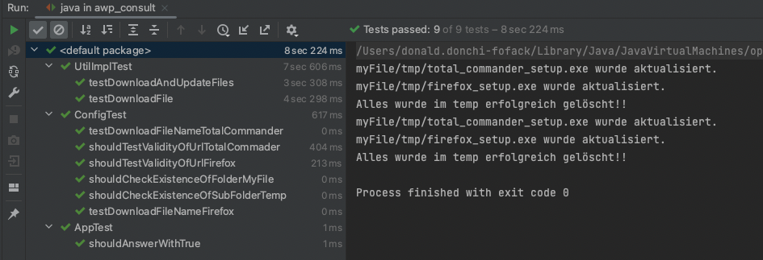

## Inhaltsverzeichnis
1. [Beschreibung des Projekts](#beschreibung-des-projekts)
2. [Voraussetzungen](#voraussetzungen)
3. [Installation](#installation)
4. [Verwendung](#verwendung)
5. [Screenhots](#screenhots)
6. [Unterstützung](#unterstützung)
7. [Contributing](#contributing)
8. [Lizenz](#lizenz)

### Beschreibung des Projekts
***
Bei diesem Projekt geht es um das Herunterladen der Windows-Setup-Dateien für die Programme "Total Commander" und "Mozilla Firefox" per HTTP(S). Dabei soll überprüft werden, ob sich die Dateien seit dem letzten Herunterladen geändert haben. Falls ja, soll die aktuelle Version der Datei mit einem festen Namen (total_commander_setup.exe bzw. firefox_setup.exe) kopiert werden. Eine bereits vorhandene Datei soll dabei überschrieben werden. Der Vorgang soll für jede Datei separat durchgeführt werden und es soll eine Ausgabe auf der Konsole erfolgen, wenn die aktuelle Dateiversion neu ist.

### Voraussetzungen
***
* JDK 11 oder höher
* Maven 3.6 oder höher

### Installation
***
1. Klone das Repository mit `git clone https://github.com/donchi-donald/UpdateChecker.git`
2. Navigiere in das Projektverzeichnis mit `cd UpdateChecker`
3. Führe `mvn package` aus, um das Projekt zu kompilieren und ein ausführbares JAR-Datei zu erstellen.

### Verwendung
***
* Führe `java -jar target/awp-consult-test-1.0.0.jar`
* Genieß die Ausgabe bei der Konsole und Wirf bitte einen Bilck im Verzeichnis `myFile`

### Screenhots 
***
* Ausgabe der Unit-Tests
  

### Unterstützung
***
* Wenn du ein Problem oder einen Fehler gefunden hast, erstelle bitte ein Issue auf GitHub.
* Wenn du eine Frage hast oder Hilfe benötigst, wende dich an mich `donchidonald2000@gmail.com`

### Contributing
***
* Ich begrüße Beiträge zur Verbesserung des Projekts. Bitte erstelle ein Pull Request auf GitHub, um deine Änderungen vorzuschlagen.

### Lizenz
* Dieses Projekt steht unter der MIT-Lizenz.

